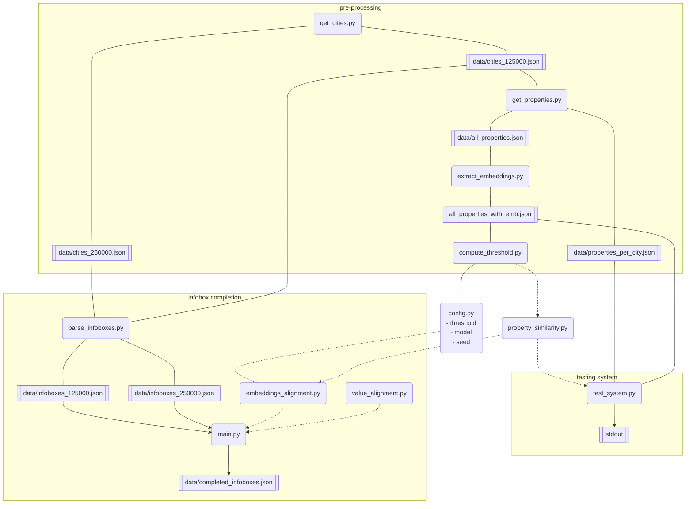

# Wiki-Infobox-Completion

## Overview

The graph below shows the coherence of the files in this repository. The description below the graph contains more information and links to the respective files. 



[get_cities.py](./get_cities.py) retrieves cities from [Wikidata](https://www.wikidata.org/wiki/Wikidata:Main_Page) that are an 'instance of' city and have a population of 125000 or more. This population threshold is to ensure that the cities are more likely have both an English and Dutch [wikipedia](https://www.wikipedia.org/) page.

[cities.json](data/cities.json) contains the cities found by get_cities.py. For each city the file contains the name of that city in English and the link to the Wikidata page.

[parse_infoboxes.py](./parse_infoboxes.py) retrieves every Wikipedia page in cities.json and retrieves the infoboxes. It processes the infoboxes into [data/infoboxes.json](./data/infoboxes.json), which contains all the property-value pairs for every city in both languages.

[property_similarity.py](./property_similarity.py) contains the code to compute similarity between two properties in different languages using a pretrained multilingual large language model. 

To test how well the property_similarity.py script works, there are two scripts for testing the system. [get_properties.py](./get_properties.py) uses the Wikidata links in cities.json to extract all the unique properties that are found in all the cities pages. For these properties it retrieves both the Dutch and English names for the properties, and their frequencies. This information is saved in [all_properties.json](./data/all_properties.json). [test_system.py](test_system.py) will use these language pairs to evaluate the property_similarity.py method.

The final processing happens in [complete_infoboxes_threshold.py](./complete_infoboxes_threshold.py) and [complete_infoboxes_robust.py](./complete_infoboxes_robust.py). The threshold variation uses code from test_system.py to set a similarity threshold. It will loop over the properties and if it finds one above the threshold it decides it is the same, and if no properties are found it will create a new property. The robust variation computes the similarity between all possible options, and will then pick the most similar properties. While this is computationally more expensive, this should be more robust since all combinations are tested. 

The final test will be a qualitative evaluation, where we select a random sample of infoboxes from [completed_infoboxes_features.json](./data/completed_infoboxes_features.json) and [completed_infoboxes_robust.json](./data/completed_infoboxes_robust.json), and check if the completion was successful. 

## Running the code

To run the code, use a Python version of 3.10 or above.

 Create a virtual environnment, activate it, and install the requirements:

```bash
python3 -m venv env
source env/bin/activaten
pip3 install -r requirements.txt
```

Then pick a file to run. The correct filenames are provided.